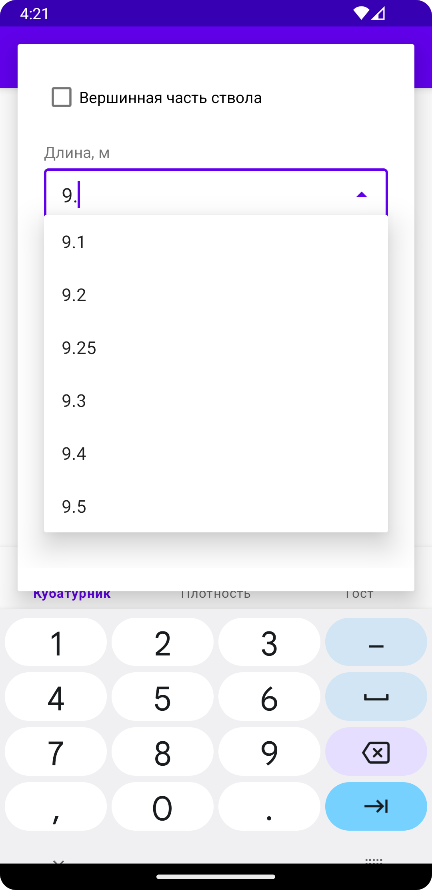
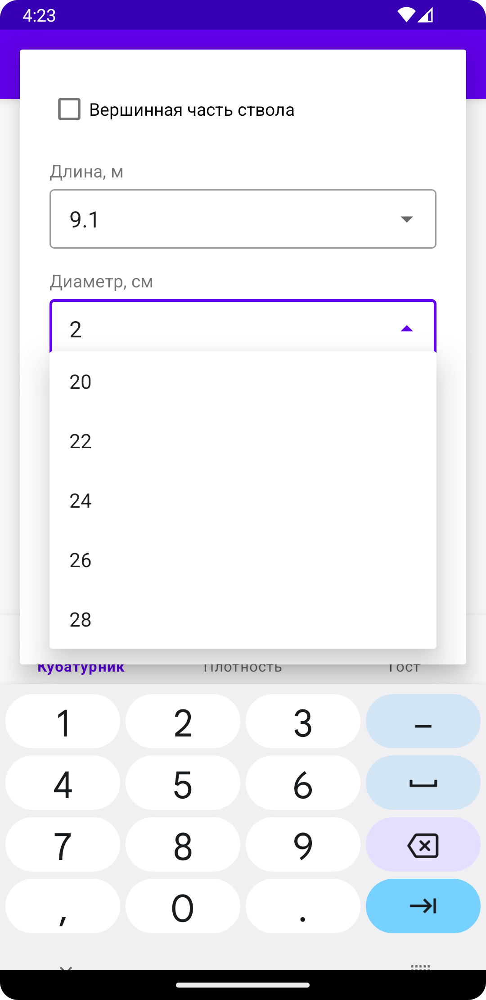

# Калькулятор леса (Кубатурник)

Приложение, с помощью которого можно рассчитать объем леса по ГОСТ 2708-75.
Так же с его помощью можно расчитать плотность древесины в зависимости от влажности и посмотреть гост.

## Архитектура и стек технологий

+ Single Activity Application
+ MVVM + LiveData
+ Dagger
+ Room
+ JUnit + Espresso
+ Multimodule project (feature)

## Описание работы приложения

### Кубатурник

После клика на Добавить - открывается экран ввода данных - расчет объема расчитывается в зависимости от того,
является ли выбранная часть ствола вершинной, от его длины и толщины (диаметра).
Когда пользователь начинает вводить данные в поле длины - срабатывает автоподсказка с выпадающим списком с учетом,
является ли эта часть ствола вершинной (выбрана ли галочка). Автоподсказка на толщину помимо флага вершинной части ствола
учитывает так же значение длины, чтобы дальньейшие результаты были корректными
Ограничение на количество штук - 999999999, что связано с дальнейшими вычислениями результатов и ограничениями типов данных.

<code></code>
<code></code>
<code></code>

После ввода данных на основном экране добавляются chips с вычисленным объемом и количеством штук,
а так же вычисляется общий объем всех добавленных chips-ов

<code></code>

### Расчет плотности
Здесь в зависимости от породы древесины и влажности по клику на соответсвующие поля и выбору значений из автоподсказок расчитывается плотность

<code></code>
<code></code>
<code></code>

### Гост
Просмотротрщик ГОСТа - можно пролистать и посмотреть данные для расчета кубатуры леса непосредственно в госте

<code></code>

